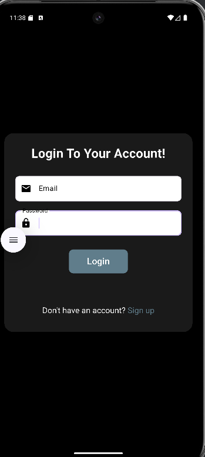
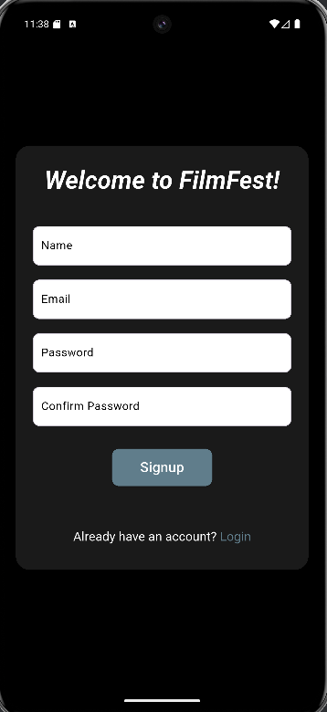
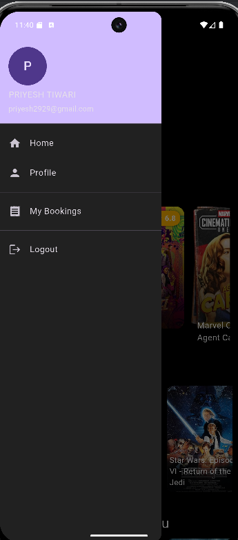
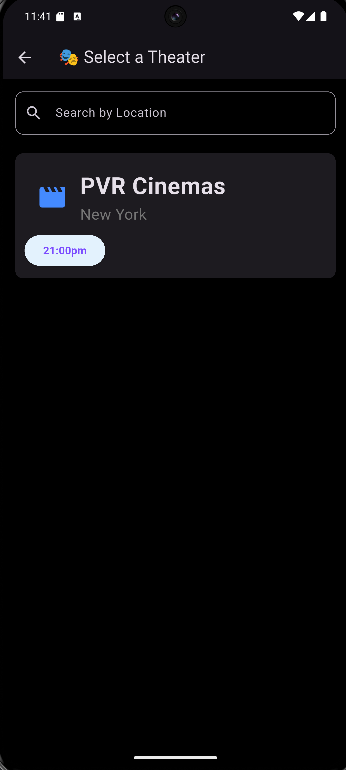
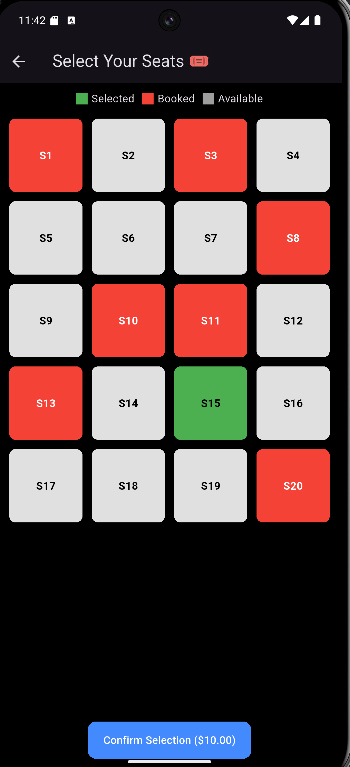
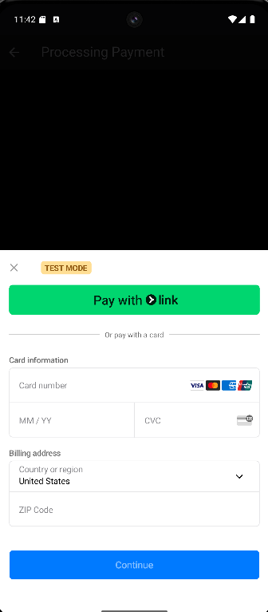
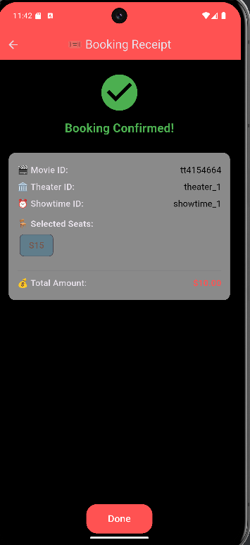

# Movie Ticket Booking App

A Flutter-based mobile application for booking movie tickets. This project includes Firebase authentication, seat selection, payment integration with Stripe, and a user-friendly interface.

## Features

- User Signup & Login with Firebase Authentication
- Browse movies and view movie details
- Select theater and seats
- Make payments using Stripe
- Generate receipts for booked tickets
- Drawer for navigation and profile management

## Screenshots

### Home Screen


### Login Screen


### Sign Up Screen


### Drawer


### Movie Description


### Theater Selection


### Seat Selection


### Booking Confirmation


### Stripe Payment


### Receipt


## Tech Stack

- **Frontend:** Flutter
- **Backend:** Node.js (for Stripe payment integration)
- **Database & Authentication:** Firebase
- **Payment Gateway:** Stripe

## Getting Started

1. Clone the repository:
```bash
git clone https://github.com/revenger3/movie-ticket-booking.git
